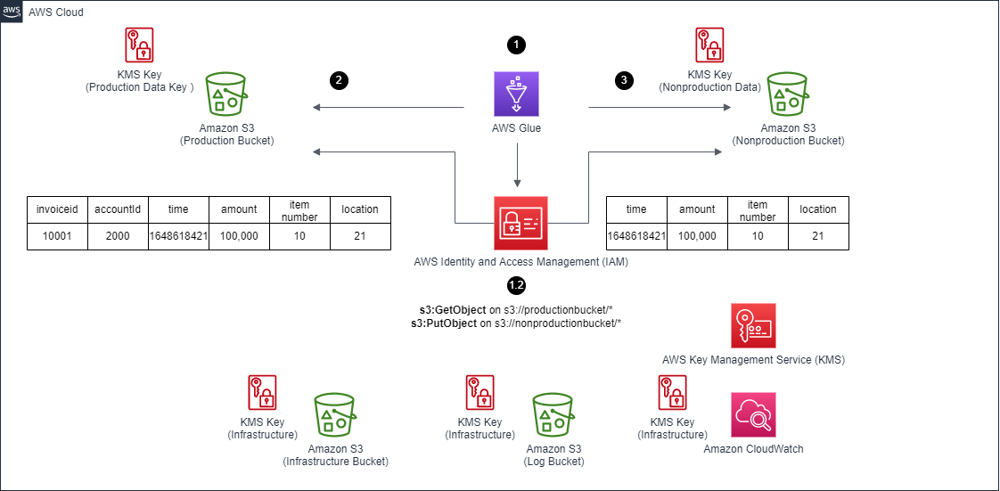

# Glue Data Sanitization from Production S3 Bucket to Lower Environment S3 Bucket APG Example

[[_TOC_]]

## Overview
Business store existing production transactions (i.e. purchase history) for audit and business purposes.

These data will be can provide additional value by being leveraged for machine learning/large data lake to provide better services align for end users. However, all PII (Personally identifiable Information)/other regulated info must be removed before these data can reach lower environment for regulation and security reasons. In past, these type of ETL (extract, transform and load) service is implemented through custom home - grown solutions or leveraging services such [AWS EMR](https://aws.amazon.com/emr/). Some businesses prefer to focus on ETL business logics and leave the management of infrastructures (i.e. management of virtual machines) to AWS.

This article explains to leverage [AWS Glue](https://aws.amazon.com/glue/) as a stateless ETL solution to perform data sanitization (remove of PII and regulated contents) as part of moving data from production [Amazon Simple Storage Service (Amazon S3)](https://aws.amazon.com/pm/serv-s3/) data bucket to non-production [Amazon Simple Storage Service (Amazon S3)](https://aws.amazon.com/pm/serv-s3/) data bucket.

## Prerequisites 
1. An Active AWS Account. (See [AWS Account](https://aws.amazon.com/account/) Page.)

2. AWS CDK ToolKit Installed. (See [AWS CDK Toolkit](https://docs.aws.amazon.com/cdk/v2/guide/cli.html) in the AWS CDK documentation.) 

3. User with sufficient access to create AWS resources for this pattern.(See IAM role in [AWS IAM Roles](https://docs.aws.amazon.com/IAM/latest/UserGuide/id_roles.html) Documentation.)

4. User should have programmatic access keys.(See [IAM user and Access](https://docs.aws.amazon.com/IAM/latest/UserGuide/id_users_create.html) in the AWS IAM documentation.)

5. Amazon command line interface (AWS CLI). (See [Installing, updating, and uninstalling the AWS CLI](https://docs.aws.amazon.com/cli/latest/userguide/getting-started-install.html) in the AWS CLI documentation.)

6. Knowledge of AWS services: [Amazon Simple Storage Service (Amazon S3)](https://aws.amazon.com/pm/serv-s3/), [AWS Identity and Access Management (IAM)](https://aws.amazon.com/iam/),  [AWS Key Management Service (KMS)](https://aws.amazon.com/kms/), [Amazon CloudWatch](https://aws.amazon.com/cloudwatch/) and [AWS Glue](https://aws.amazon.com/glue/).

## Limitations
The sample code is acting as a high-level implementation, following should be addressed within actual implementation for production setup:

1. The [AWS Simple Cloud Storage (S3)](https://aws.amazon.com/s3/) bucket in this sample does not have versioning enable to keep the sample simple. Please evaluate and update the setup as needed.

2. This code sample uses limited privileges compare to [AWSGlueServiceRole](https://docs.aws.amazon.com/glue/latest/dg/create-service-policy.html) for the Glue job execution role. This is for the least privilege purpose. The glue job with this role and the current setup (source and destination S3 buckets) will able to success in the setup. However, if the Glue scripts is updated in the Glue Web Console to point to different/additional S3 buckets/resources, this role will need to be adjusted for the Glue job execution to success. Please adjust per business requirement.

3. The sample code is tested with up to date cdk-nag [cdk-nag](https://github.com/cdklabs/cdk-nag) to check for policies at time of the written. It is possible there maybe new policies enforced in future. These new policies may require users to manual modify the stack per recommendation before the stack can be deployed. Please also review the existing code to ensure it aligns with users' business requirement.

4. The stack deletion process will not clean up [CloudWatch Logs (Log Groups/Logs)](https://aws.amazon.com/cloudwatch/) generated by the stack. It will require users to manually clean up either through AWS CloudWatch console/API.

5. The code relies on CDK to generate random suffix instead of relying on static assigned physical name for most created resources. This setup is to ensure these resources are unique and not conflict with other stack as per [CDK Doc (under Physical names section)](https://docs.aws.amazon.com/cdk/v2/guide/resources.html). Please adjust per business requirement.

## Target technology stack  

### S3 Buckets
One Amazon S3 bucket `productionDataBucket` is setup to represent production data storage solution. It is encrypted with [AWS Key Management Service (KMS) Key](https://aws.amazon.com/kms/) `productionDataKey`.

One Amazon S3 bucket to represent the lower environment storage solution `nonproductionDataBucket`. It is encrypted with [AWS Key Management Service (KMS) Key](https://aws.amazon.com/kms/) `nonproductionDataKey`.

One Amazon S3 bucket `infrastructureBucket` is setup to store Glue scripts/other internal scripts in future. It is encrypted with [AWS Key Management Service (KMS) Key](https://aws.amazon.com/kms/) `infrastructureKey`.

One Amazon S3 bucket `logBucket` is setup to store logs from Glue job executions/other infrastructure. It is possible to output most logs into [Amazon CloudWatch Logs](https://aws.amazon.com/cloudwatch/). But depend on use cases/libraries, may also prefer to store log output into S3 bucket. It is encrypted with [AWS Key Management Service (KMS) Key](https://aws.amazon.com/kms/) `infrastructureKey`.

The difference of keys is to simulate real - world behavior as business will use different AWS KMS key for different environments. These buckets are in the same account. But a similar setup can be done for buckets between different accounts with correct [AWS Identity and Access Management (IAM)](https://aws.amazon.com/iam/) setup. More detail can be found in the [doc](https://aws.amazon.com/premiumsupport/knowledge-center/cross-account-access-s3/).


### Glue Job Setup
AWS Glue supports S3 Bucket (can point to specific prefix) as data source and data target.

This opens up possibility for use case to move production data to lower environment with data sanitization:

- One approach is data field drop (remove particular fields from each record).
- Other approaches such as select particular fields ETL tasks are supported.

It is possible to do data content level manipulation, but recommend to keep at field level as a simpler start point.

In this sample, the Glue job will read input CSV files from `productionDataBucket`, which have following fields:

| invoiceId |	accountId |	purchaseTime |	purchaseAmount |	purchaseItemNumber |	location |
| --- | --- | --- | --- | --- | --- |
|i-1100 |	a-1003 |	1648618421796 |	787 |	1 |	36 |

The Glue job will remove user sensitive fields: `invoiceId` and `accountId` during the ETL process. Note removal fields may depend on business use cases. The field `location` in this case is a coarse identifier not directly tie to user, so it is kept to be utilized in the lower environment analyze.

Glue job will then upload processed data into `nonproductionDataBucket`, which will only contain following fields:

| purchaseTime |	purchaseAmount |	purchaseItemNumber |	location |
| --- | --- | --- | --- |
| 1648618421796 |	787 |	1 |	36 |

Following is the Glue Script snip for fields removal:
```
DropProductionFields_node2 = DropFields.apply(
    frame=S3bucket_node1,
    paths=["invoiceId", "accountId"],
    transformation_ctx="DropProductionFields_node2",
)
```

### Glue Job IAM Role and Security Setup
AWS Glue job will require an explicit IAM role to be assigned. This code sample uses limited privileges compare to [AWSGlueServiceRole](https://docs.aws.amazon.com/glue/latest/dg/create-service-policy.html) for the Glue job execution role. This is for the least privilege purpose. The glue job with this role and the current setup (source and destination S3 buckets) will able to success in the setup. However, if the Glue scripts is updated in the Glue Web Console to point to different/additional S3 buckets/resources, this role will need to be adjusted for the Glue job execution to success, which breaks the Web Console experiences but provide better security. One recommendation is to limit the privileges on the production setup for security while have relax privileges on the lower environment to leverage the Glue Web Console integration experience.

The role only has `READ` privileges (S3 bucket and correspond KMS key access) to `productionBucket` and `infrastructureBucket` as it should not be able to modify data/nor script in production.

The role has `READ/WRITE` privileges (S3 bucket and correspond KMS key access) to `nonproductionDataBucket` and `logBucket` to write processed data and logs.

This allows the finer detail security lock down to ensure the job cannot modify production data nor access areas outside of its task.

The [Glue Security Configuration](https://docs.aws.amazon.com/glue/latest/dg/console-security-configurations.html) is setup with following for this sample code:
```
      encryptionConfiguration: {
        cloudWatchEncryption: {
          cloudWatchEncryptionMode: "SSE-KMS",
          kmsKeyArn: infraProductionkmsKey.keyArn
        },
        jobBookmarksEncryption: {
          jobBookmarksEncryptionMode: "CSE-KMS",
          kmsKeyArn: infraProductionkmsKey.keyArn
        },
        s3Encryptions: [{
          s3EncryptionMode: "DISABLED",
        }],
      },
      name: 'glue-security-configuration',
    }
```

One important note behind the `S3EncrpytionMode` as `DISABLED` is because the Glue job will work with S3 buckets encrypted with different KMS keys. Glue by default will force specified KMS key on S3 and [override existing S3 setting](https://docs.aws.amazon.com/glue/latest/dg/console-security-configurations.html). By not specifying key and reduced the S3 privileges (so Glue will not force the setup on S3 bucket). The AWS S3 clients within Glue will auto communicate with S3 API with appropriate KMS keys.

### Glue Job Bookmark
This sample code disables the [Glue Bookmark](https://docs.aws.amazon.com/glue/latest/dg/monitor-continuations.html) behavior by default for easier debugging.
But please adjust as needed base on use case in `<git repo>/lib/glue-data-sanitization-from-production-s3-bucket-to-lower-environment-s3-bucket-stack.ts`
```
        // Disable bookmark for easier debugging to reuse data
        "--job-bookmark-option": "job-bookmark-disable",
```

## Target architecture 


### Overall Flow
1. AWS Glue job starts.
2. The job downloads Glue scripts from `infrastructureBucket` through its IAM role and `infrastructureKey` KMS key to unencrypt data.
3. The job downloads data from data source `productionDataBucket` through its IAM role and `productionDataKey` KMS key to unencrypt data.
4. During the job ETL processes, will output logs into CloudWatch Logs/S3 Bucket`logBucket` through its IAM role and `infrastructureKey` KMS key to encrypt/unencrypt logs. The Glue job will remove user sensitive fields: `invoiceId` and `accountId` during the ETL process.
5. The job uploads final processed data into data target `nonproductionDataBucket` through its IAM role and `nonproductionDataKey` KMS key to encrypt data.

## Deploy / Clean up
Deploy this stack to your default AWS account/region (assume [AWS CDK](https://aws.amazon.com/cdk/) 2.20.0 or later installed)

IMPORTANT: Please save the output from Outputs section from stack deployment below as it will be used in later stories

1. Install dependencies
In the git repo, please open a terminal and setup following
```
# installs dependencies for cdk stack
npm install
```

2. Deploy the stack
In the git repo, please open a terminal, ensure AWS CLI credential is valid, then perform following:
```
# deploys the stack
cdk deploy
```

3. Confirm the created stack is in correct account and IAM roles preview, then press y to confirm.

4. Wait for the stack to complete and verify its output is similar to below
Outputs Example:
```
GlueDataSanitizationFromProductionS3BucketToLowerEnvironmentS3BucketStack.InfrastructureBucketName = gluedatasanitizationfrom-internalinfrastructurebu-147oidtt8rvc
GlueDataSanitizationFromProductionS3BucketToLowerEnvironmentS3BucketStack.NonproductionDataBucket = gluedatasanitizationfrom-nonproductiondatabucket8-1vszyhtbh577d
GlueDataSanitizationFromProductionS3BucketToLowerEnvironmentS3BucketStack.ProductionDataBucketName = gluedatasanitizationfrom-productiondatabucketf941-f0qgz6598g95
```

5. Copy the Glue scripts folder to S3 for Glue Job execution
In the git repo, please open a terminal, ensure AWS CLI credential is valid, then perform following:
```
cd glue-scripts/
aws s3 sync . s3://<InfrastructureBucketName>/
cd ..
```

Example
```
cd glue-scripts/
aws s3 sync . s3://gluedatasanitizationfrom-internalinfrastructurebu-147oidtt8rvc/
cd ..
```

6. Copy the sample data to `productionDataBucket` S3 bucket

In the git repo, please open a terminal, ensure AWS CLI credential is valid, then perform following:
```
cd test-data/
aws s3 cp dataset_0.csv s3://<ProductionDataBucketName>/
aws s3 cp dataset_1.csv s3://<ProductionDataBucketName>/
cd ..
```

Example
```
cd test-data/
aws s3 cp dataset_0.csv s3://gluedatasanitizationfrom-productiondatabucketf941-f0qgz6598g95/
aws s3 cp dataset_1.csv s3://gluedatasanitizationfrom-productiondatabucketf941-f0qgz6598g95/
cd ..
```

7. Execute the Glue Job
Please first go to AWS Console -> Services -> Glue -> Jobs -> Select job `glue-etl-job` -> Click on `Run` to execute the job
Note: Only one execution can happen at a time

8. Verify the data in `nonproductionDataBucket` S3 bucket
In an empty temp directory that data can be downloaded, please open a terminal, ensure AWS CLI credential is valid, then perform following:
```
aws s3 sync s3://<NonproductionDataBucket>/ .
```

Example
```
aws s3 sync s3://<gluedatasanitizationfrom-nonproductiondatabucket8-1vszyhtbh577d>/ .
```

And open the data with text editor/editor that can analyze csv, will note the data sanitization is completed on the file as the data columns tie to individual users are removed.

### Clean Up Deployment (Optional)

This is an optional step in case need to destroy the stack. One advantage of clean up is to save costs from provisioned infrastructures.

In the git repo, please open a terminal, ensure AWS CLI credential is valid, then perform following:
```
cdk destroy
```     
Confirm the deletion prompt to proceed with the stack deletion.

## Sample Dataset
Sample dataset for the setup test can be found in [test-data](test-data) folder

Can regenerate again through (assume [Node.js](https://nodejs.org/en/) later than 10.x installed)
```
node generate.js
```
